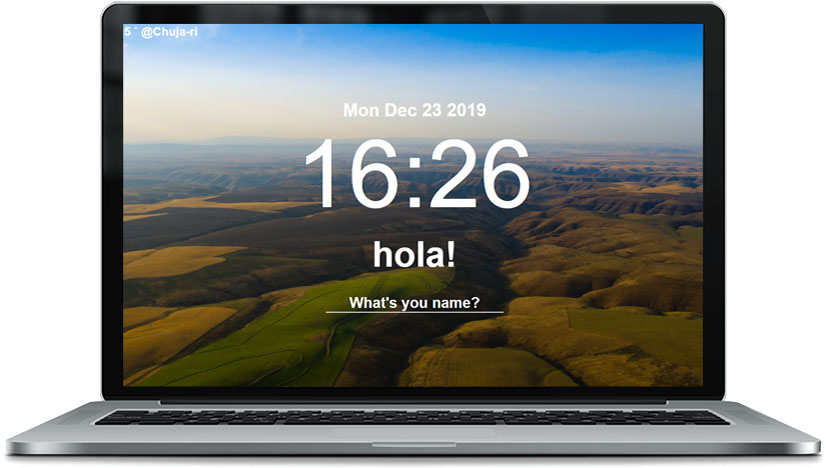

# Momentum
Clone coding Momentum of Google Chrome extensions 

## Features

1. Real Time Clock
2. Username Persistance
3. To Do List
4. Random Background Image
5. Weather with Geolocation
6. Offline Support

## Screen

## link

https://anxiubin.github.io/Momentum/

## Languages
- HTML
- CSS
- Vanilla JavaScript